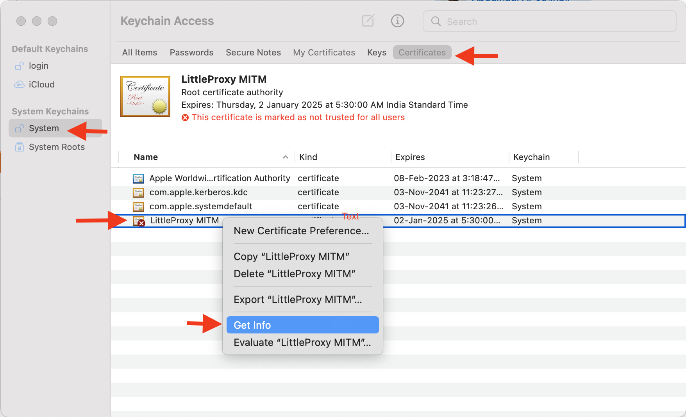
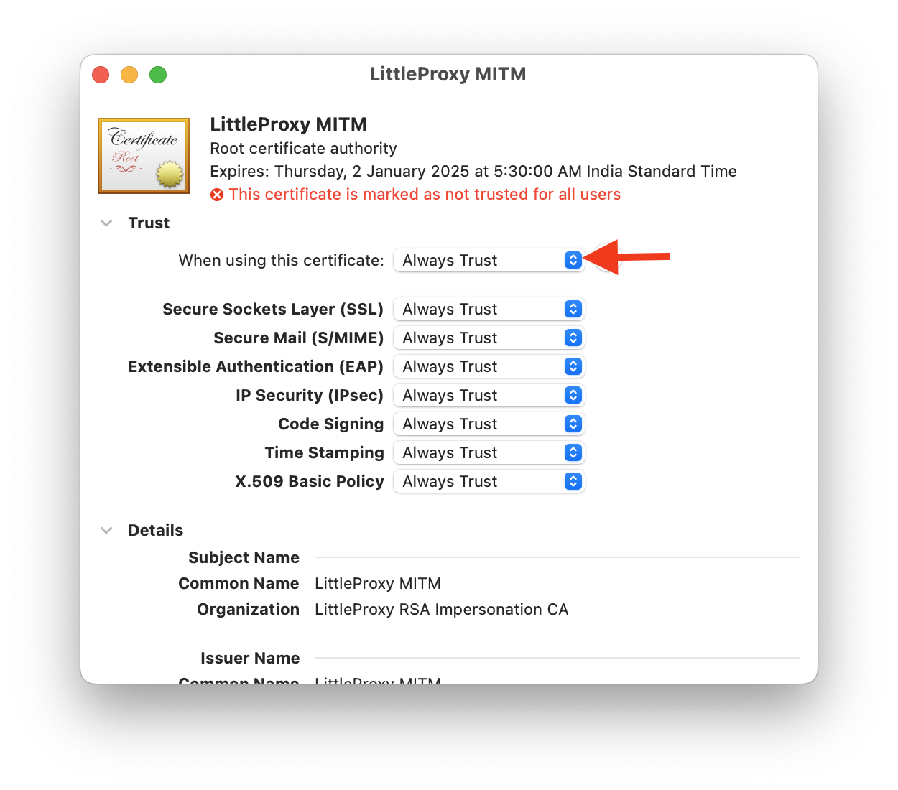
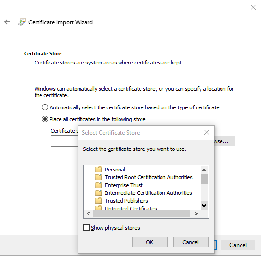
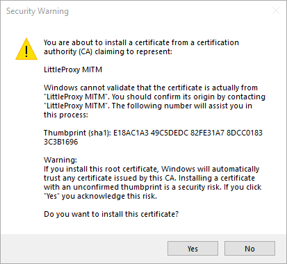

# Oxylabs’ Residential Proxies integration with Selenium using Java

[](https://github.com/topics/java) [](https://github.com/topics/selenium) [](https://github.com/topics/web-scraping) [](https://github.com/topics/rotating-proxies)

- [Introduction](#introduction)
- [Prerequisites](#prerequisites)
- [Requirements](#requirements)
- [Running the Code](#running-the-code)
  - [Compiling the Source Code](#compiling-the-source-code)
  - [Running the Jar](#running-the-jar)
- [Proxy Authentication](#proxy-authentication)
- [Testing Proxy Connection](#testing-proxy-connection)
- [Getting Country Specific Proxy](#getting-country-specific-proxy)
- [SSL Support](#ssl-support)
  - [Installation Certificate for macOS](#installation-certificate-for-macos)
  - [Installation Certificate for Windows](#installation-certificate-for-windows)
- [Understanding the Code](#understanding-the-code)

## Introduction

Integrating proxies that need authorization using the Selenium framework and Java programming 
language can be challenging. 

This tutorial contains complete code demonstrating how [Oxylabs’ Residential Proxies](https://oxy.yt/RrBU) can be 
easily integrated with Selenium using Java. 

## Prerequisites

- Download and install [Maven](https://maven.apache.org/download.cgi).
- Download and install [Java SE Development Kit](https://www.oracle.com/java/technologies/downloads/).
- Download and install [Google Chrome](https://www.google.com/chrome).

## Requirements

To make this integration easier, we used [BrowserMob Proxy](https://github.com/lightbody/browsermob-proxy) 
as a middle layer. It runs proxies locally in JVM and allows chaining of Oxylabs' authenticated proxies. 
If you’re using Maven, add this dependency to the `pom.xml` file:

```xml

<dependency>
    <groupId>net.lightbody.bmp</groupId>
    <artifactId>browsermob-core</artifactId>
    <version>2.1.5</version>
</dependency>
```

The other library used in this project – [WebDriverManager](https://github.com/bonigarcia/webdrivermanager), 
is optional. It just makes downloading and setting up [Chrome Driver](https://chromedriver.chromium.org/downloads) 
easier. To use this library, include the following dependency in `pom.xml` file:

```xml

<dependency>
    <groupId>io.github.bonigarcia</groupId>
    <artifactId>webdrivermanager</artifactId>
    <version>5.0.2</version>
</dependency>
```

If you don’t want to use WebDriverManager, download the Chrome Driver and set the system property as follows:

```java
System.setProperty("webdriver.chrome.driver","/path/to/chromedriver");
```

## Running the Code

### Compiling the Source Code

This is a maven project. To compile this project, run the following command from terminal:

```shell
mvn clean package
```

This will create the file `oxylabs.io-jar-with-dependencies.jar` in the `target` folder.

### Running the Jar

To run the jar, execute the following command from the terminal:

```shell
java -cp target/oxylabs.io-jar-with-dependencies.jar ProxyDemo
```

## Proxy Authentication

Open [ProxySetup.java](src/main/java/ProxySetup.java) file and update your username, password, and endpoint.

```java
static final String ENDPOINT="pr.oxylabs.io:7777";
static final String USERNAME="yourUsername";
static final String PASSWORD="yourPassword";
```

You shouldn’t include the prefix `customer-` in the `USERNAME.` This will be added in the code for country-specific proxies.

## Testing Proxy Connection

Open this project in IDE, open the [ProxySetup.java](src/main/java/ProxySetup.java) file, and run the `main()` function. 
This will print two IP addresses.

- The first IP address will be completely random;
- The second IP address will be a country-specific IP address in Germany.

## Getting Country Specific Proxy

Open [ProxyDemo.java](src/main/java/ProxyDemo.java) file and send a two-letter country code to the function `CountrySpecficIPDemo`.

```java
countrySpecificIPDemo("DE");
```

The value of this parameter is a case-insensitive country code in two-letter [3166-1 alpha-2 format](https://en.wikipedia.org/wiki/ISO_3166-1_alpha-2). For example, `DE` for 
Germany, `GB` for the United Kingdom, etc. For more details, see Oxylabs’ [documentation](https://developers.oxylabs.io/proxies/residential-proxies/select-country#code-example).

## SSL Support

This code uses BrowserMob Proxy, which supports full MITM. 

You may still see invalid certificates warnings. To solve this, install the [ca-certificate-rsa.cer](certificates/ca-certificate-rsa.cer) file in your browser or HTTP client. Alternatively you can generate your own private key rather than using the .cer files distributed with repository.

### Installation Certificate for macOS
- Open Keychain Access
- Selct `System` on left bar
- Click the padlock icon next to `System` and enter your password when prompted
- Select `Certificates` tab on the top
- Drag and drop the `ca-certificate-rsa.cer` file into the `Certificates` tab. You will notice a new certificate appears in the `Certificates` tab with the name `LittleProxy MITM`.


- Right click the certificate and select `Get Info`
- Select `Always Trust`, close the dialog, and enter password again when promoted
  



### Installation Certificate for Windows

- Open the `ca-certificate-rsa.cer` file in Windows Explorer.
- Right click the file, and select `Install`.
- In the Certificate Import Wizard window, click `Browse` and select `Trusted Publishers`. Click `OK` to continue.


- If you see a Security Warning, select `Yes`.


- Follow the wizard to complete the installation.

## Understanding the Code

All the complexity of setting up BrowserMob Proxy and Chrome Options is hidden in
the [ProxyHelper](src/main/java/ProxyHelper.java) class.

In most cases, you should be able to use this file directly without any change.

To create a Chrome Driver instance, go through a two-step process as follows:

First, create an instance of `BrowserMobProxyServer`. This is where you need to provide the proxy endpoint, username, and password.

The fourth parameter is a two-letter country code. If you don’t need a country-specific proxy, set it to `null`:

```java
BrowserMobProxyServer proxy=ProxyHelper.getProxy(
        ProxySetup.ENDPOINT,
        ProxySetup.USERNAME,
        ProxySetup.PASSWORD,
        countryCode)
```

Next, call the `ProxyHelper.getDriver()` function.

This function takes up two parameters -`BrowserMobProxyServer` and a `boolean` headless. To run the browser in headless mode, send `true`:

```java
WebDriver driver=ProxyHelper.getDriver(proxy,true);
```

`driver` is an instance of Chrome Driver.

Now, you should write your code to use the Chrome Driver.

Before exiting, remember to close the driver and stop the proxy:

```java
driver.quit();
proxy.stop(); 
```

If you're having any trouble integrating Oxylabs’ Residential Proxies with Selenium and this guide didn't help you – feel free to contact our customer support at support@oxylabs.io.
